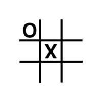

# Tic Tac Toe DDD



**Tic Tac Toe DDD** reproduces tic tac toe game in 3D mode. The project is based on [Next.js](https://nextjs.org/) written in Typescript, HTML and CSS. The UI is created using [Mui Components](https://mui.com/).

## Gameplay

The user plays against AI (min max algorithm) and can only win in a particular solution, thinking out of the box. 

## Development 

First, run the development server:

```bash
npm run dev
```

Open [http://localhost:3000](http://localhost:3000) with your browser to see the result.

## Build

```bash
npm run build
```

## Startup

```bash
npm run start
```

http://localhost:8080

## Docker

Build and run

```
sh build.sh
sh start.sh
```